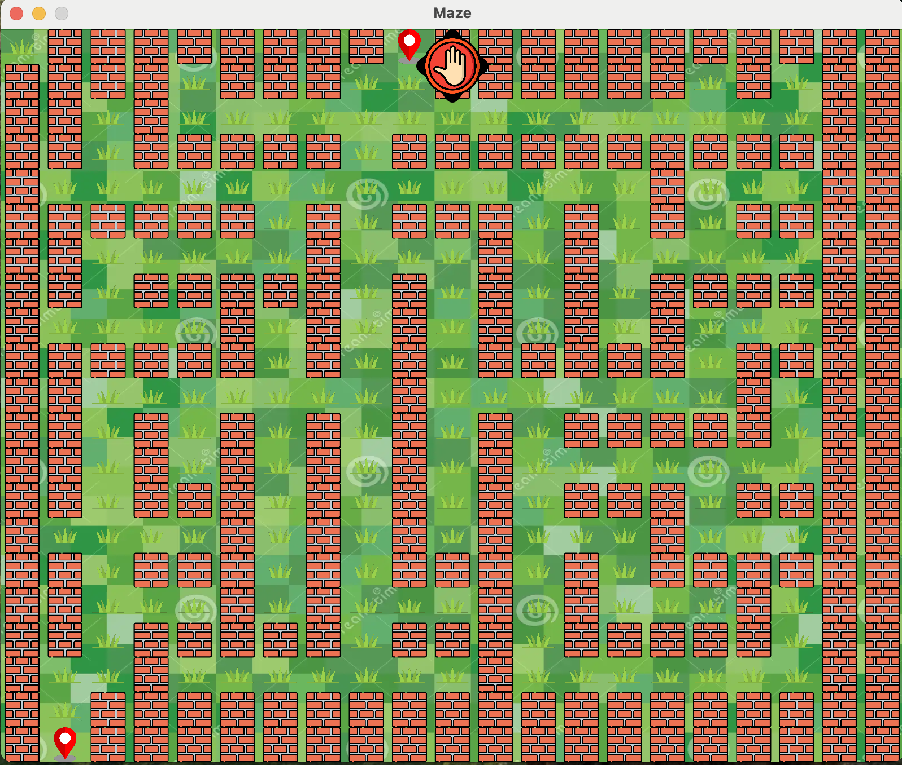
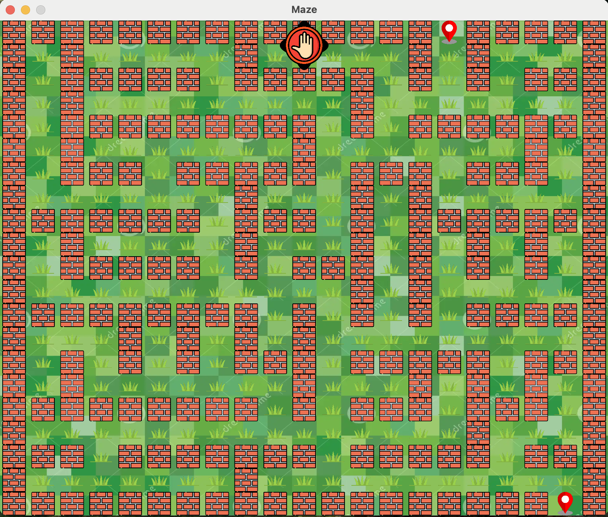

# Author
**Shivang Chaudhary**
  - [GitHub](https://github.com/Shiv716)
  - [LinkedIn](https://www.linkedin.com/in/shivang-chaudhary-2235831b5/)

# Maze Generator

This is the maze generating GUI application built using Kivy in Python. The mazes are generated using the Prim's algorithm and are guaranteed to be solvable.

## Requirements

- Python 3.x
- Kivy

## Installation

1. Clone the repository:
    ```
    git clone <https://github.com/Shiv716/Flare_Maze_generator.git>
    ```
2. Navigate to the project directory:
    ```
    cd Maze_FlareIntern
    ```
3. Install the required packages:
    ```
    pip install kivy
    ```

## Usage

To run the application, use the following command:
 ```
    python3 Maze_gui.py
 ```

## Sample Mazes
- Each new maze is generated at the click of the button in the maze.<br>
- Each location mark specifies the starting and ending point in every new generated maze.
<p align="center">
  
  
</p>
